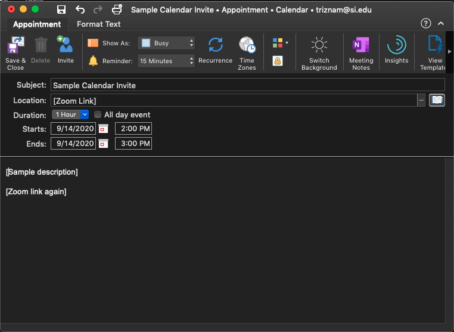

# Saving a calendar invite for sharing

The following instructions are for creating an .ICS calendar invite file using Microsoft Outlook.

This method is really helpful for letting users save a spot on their calendar, but one downside is that the organizer does not get any kind of RSVP "notification" of who is planning to attend an event. Keep this in mind when choosing between this and directly inviting participants via an Outlook "Meeting".

## Creating an .ICS file in Outlook

Start out by creating a new Appointment in Outlook.

Next, set the correct time, and fill in all relevant meeting details. Behind the scenes, Outlook will save your local time zone, which means that the time will automatically translate for participants in other time zones. You can also modify the "Reminder" time at this step. By default, it is set to 15 minutes prior to the event, but you can set to 1 hour or 1 day if you like.

Once you are satisfied with the details, click the "Save and Close" button.

To save this event to a file, first find the event in your calendar.

If you are on a Mac, click on the calendar event, and drag it to your desktop (or to a folder in your Finder app). This will create a .ICS file with a filename created from your event Subject field.

If you are on a Windows computer, dragging the event to your desktop will create a .MSG file, which is not universally-supported. The best way to save to .ICS is to open up the event, click on File > Save As, and then save it as a .ICS file through that dialog window.

## Sharing an .ICS file

You can share an .ICS file as you would any other file: as an email attachment, via Slack, etc.

If you would like to share via a link, a good place to put the file is in the "Files" directory of the Carpentries workshop event template. Here's a link to the Sample .ICS file: [https://smithsonianworkshops.github.io/2020-08-11-smithsonian/files/Sample%20Calendar%20Invite.ics](https://smithsonianworkshops.github.io/2020-08-11-smithsonian/files/Sample%20Calendar%20Invite.ics), which I uploaded to the "Files" directory here: [https://github.com/SmithsonianWorkshops/2020-08-11-smithsonian/tree/gh-pages/files](https://github.com/SmithsonianWorkshops/2020-08-11-smithsonian/tree/gh-pages/files).