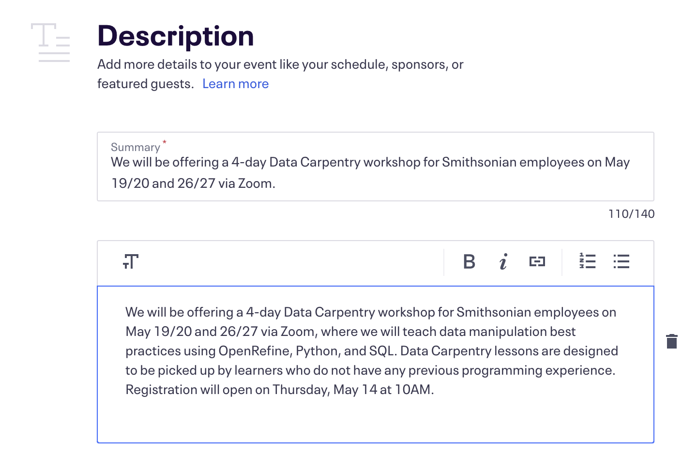
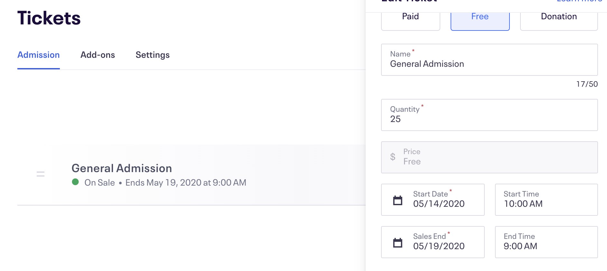
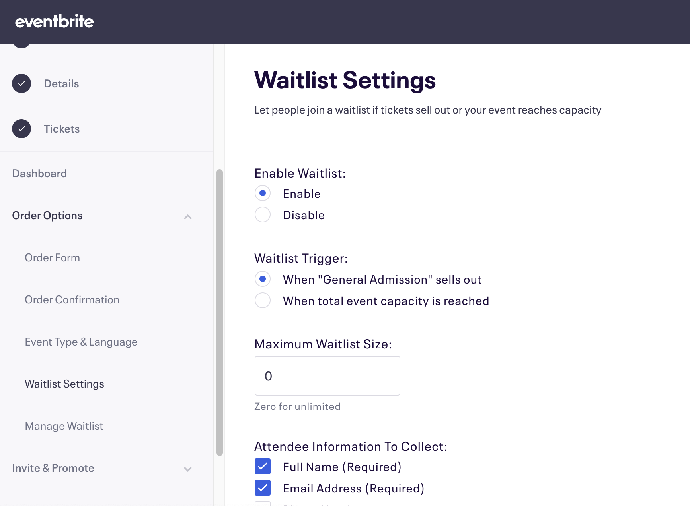
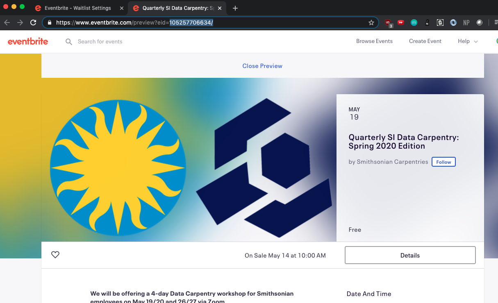
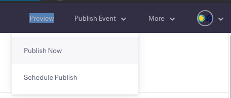

# Eventbrite Ticketing

The Smithsonian Carpentries group has our own Eventbrite account so that we can create and manage our own events. Contact Mike Trizna for the account password.

Once you are logged in a si-datascience@si.edu, the easiest way to create a new Carpentries event is to copy an existing event and make small modifications. From the home page, click the profile dropdown in the top right corner and select "Manage Events". This will take you to a listing of all previous events. (If it does not, make sure to change the "Event Status" filter to "Past"). To create a new Carpentry workshop event, pick the most recent (or most similar) previous event, click the 3 vertical dots, and select "Copy Event".

After selecting Copy Event, you will be taken to the screen shown below. Make changes in the Event Title, Summary, and event dates to match those of the new workshop. Then click the red Copy Event button.

After hitting the Copy Event button, your event will officially be created (in preview mode), and you will be taken to the Event Dashboard.

There are still a few details to change before publishing the event. First, click on the Details button on the left panel (the Basic Info page contains changes you made in the previous step). Update the event dates in the longer description panel, as well as the registration open date. Then click Save.

Next, click on the Tickets button on the left panel. You should only have 1 type of ticket available: General Admission. Click the 3 vertical dots and select Edit to make changes. Here you can modify the quantity of tickets as well as the date that tickets go "on sale".

Next, make sure a waitlist is enabled. Click on the Order Options dropdown on the left panel and click Waitlist Settings. The settings should match the screenshot below.

One more thing to check is to make sure that the event is set to "Private", so that random non-SI people don't stumble upon the event and register. Click on "Privacy Settings" on the left panel, select "Privacy", and then make sure the settings match the screenshot below.

Now, click the Preview button on the top navigation bar to make sure that everything looks alright. The preview page of the event will open in a new tab.

If everything looks ready to go, go back to the previous tab, hover over the Publish Event dropdown, and select Publish Now. Don't worry, as long as you confirmed that the event is set to Private, the event will not show up for random Eventbrite users.

Finally, take the Eventbrite event ID from the URL (look for ...*myevent?eid=**[event ID]**&*...), and insert it into the correct place on the course website. Check the commit at [https://github.com/SmithsonianWorkshops/2020-08-11-smithsonian/commit/1dede5e2c9c03e7df42b920e4b3fcd90d5be6cc2](https://github.com/SmithsonianWorkshops/2020-08-11-smithsonian/commit/1dede5e2c9c03e7df42b920e4b3fcd90d5be6cc2) to see where changes were made.
