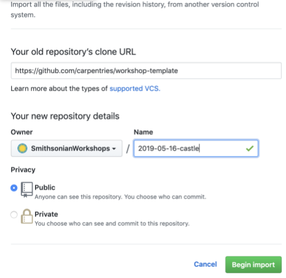

# Creating a Workshop Website

1. Log into GitHub, and go to [https://github.com/carpentries/workshop-template#creating-a-repository](https://github.com/carpentries/workshop-template#creating-a-repository). Follow the steps under "Creating a Repository" so that your screen looks like this (with different Name). Contact Mike Trizna if you do not have access to the "SmithsonianWorkshops" organization.
	
1. Test out the URL (of form *https://smithsonianworkshops.github.io/**[repo name]***), and add it to the Repo description.
1. For the next few steps, you will need to use GitHub for Desktop, which you can download from here: https://desktop.github.com/
1. Clone the new repo to your computer by going to File > Clone Repository, and selecting it from the dropdowns.
1. Go to Branch > New Branch to create a new branch. Name it "master", and choose to base it off of "gh-pages".
1. Now, make sure to switch to the new "master" branch, by changing to it in the Current Branch dropdown. You should see a screen that says No local changes, and an option to "View the files in your repository in Finder" (or Explorer on Windows). Click this button to open the folder that contains the files.
1. Now that you are in the folder containing the files, we're going to clear things out. Delete all files, except for the "(.git)" directory, ".github", ".gitignore", .editorconfig, and README.md. **IT IS SUPER IMPORTANT NOT TO DELETE .GIT.**
	
	Tip: to quickly display hidden files and folders on Mac (like .git), press CMD + SHIFT + .
	
1. Back in GitHub Desktop, you should see all of your changes listed. Enter a "Summary" and a "Description", and then click Commit to master. Then click "Publish branch" to push the changes to the GitHub site.
	
1. On the GitHub site for the repo, verify that the master branch now reflects the barebones files that are on your computer. Go to Settings > Branches, and make "master" the default branch.
1. OPTIONAL: Back in GitHub Desktop, you can "prune" some of the extra branches that come from the original repo. To do this, change to each branch in the "Current Branch" dropdown, and then click Branch > Delete. 
1. Finally, switch back to the master branch. Edit the README file to look like https://github.com/SmithsonianWorkshops/2019-05-16-castle. Back in GitHub Desktop, fill in a summary and description, Commit to master, and Push to Origin.
	1. To create a new Etherpad: go to https://pad.carpentries.org and create a new pad with the same extension as the GitHub website. For example: Course website: https://smithsonianworkshops.github.io/2019-05-16-castle/ Etherpad link: https://pad.carpentries.org/2019-05-16-castle
1. After that, you need to change the following files from the gh-pages branch:
	1. _config.yml: The only things that must be changed are:
		1. The type of carpentry (line 10)
		1. Workshop title (line 13)
	1. Index.md: this one is quite long. This where you will add all the workshop information. 
		1. Lines 2 to 18: basic info (type of carpentry, location, dates, etc). All the required info will be marked with FIXME
		1. You need to delete the irrelevant info from the SETUP part. Keep only the lessons that will be included. :) 
			TIP: each section starts and ends with a comment similar to those below. Use that info to delete the lessons you don't need.
			 Start of 'Python' section. 
			 End of 'Python' section. 
1. Additional customization: To customize the workshop schedule, syllabus, and target audience, you need to edit the files below. They can be found in the gh-branch, inside the folder _includes/<carpentrytype>. Example: for the Castle workshop, those files are at SmithsonianWorkshops/2019-05-16-castle/_includes/dc/. If it was a software carpentry workshop, it would be at SmithsonianWorkshops/2019-05-16-castle/_includes/swc.
	1. schedule.html
	1. syllabus.html
	1. who.html
